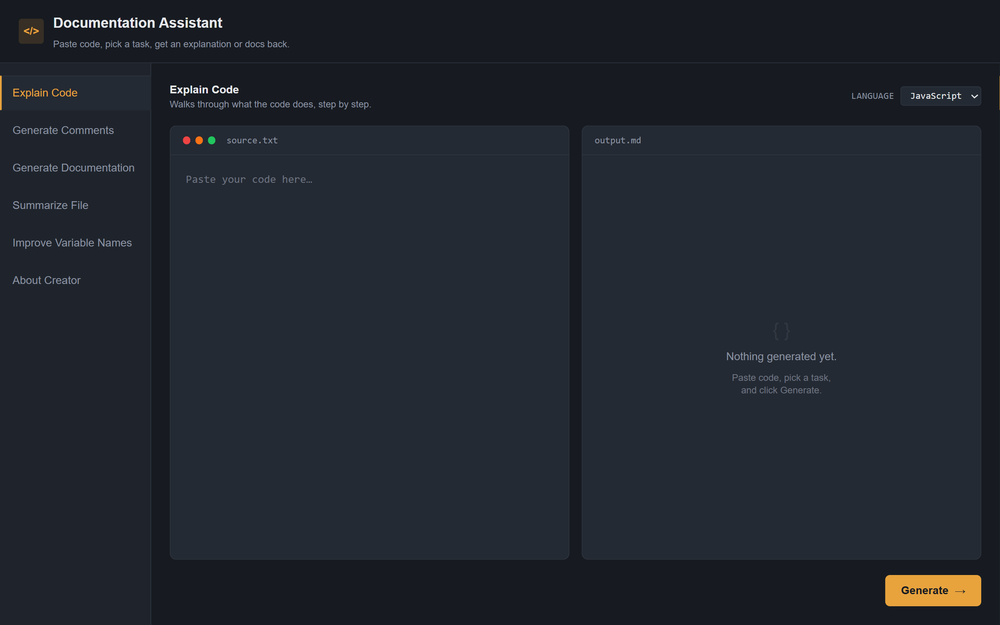
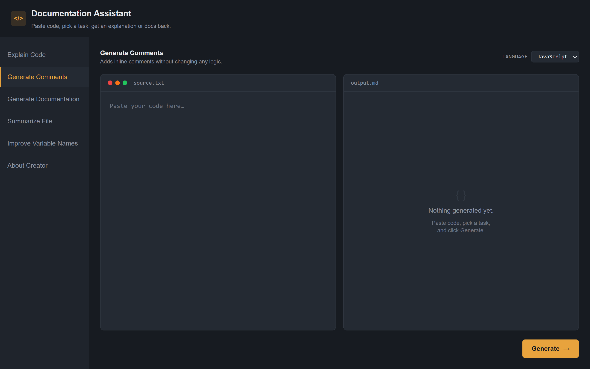
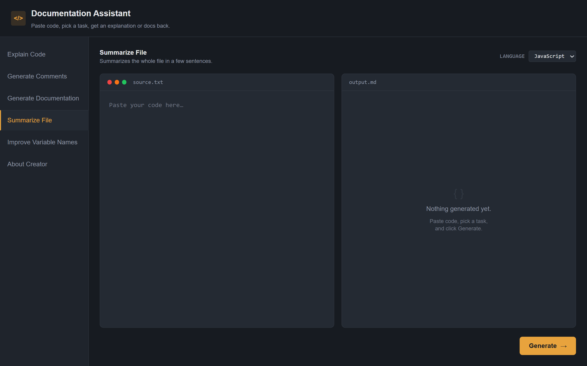
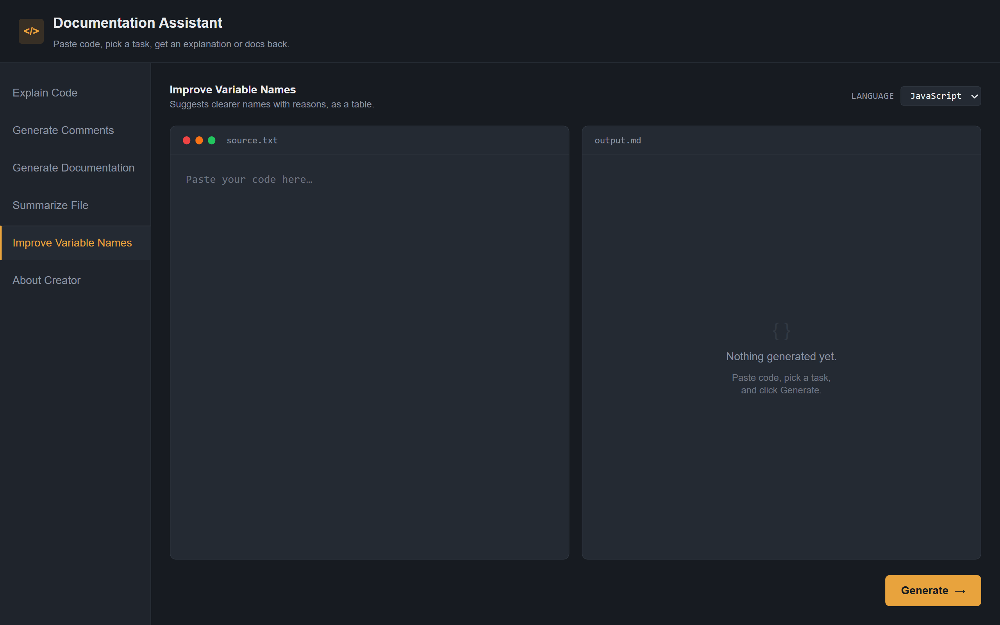

<style>
@import url('https://fonts.googleapis.com/css2?family=Inter:wght@400;500;600;700&family=JetBrains+Mono:wght@400;500&family=Space+Grotesk:wght@400;500;700&display=swap');
:root { --bg:#ffffff; --ink:#111827; --muted:#9ca3af; --accent:#111827; --line:#e5e7eb; --code:#f6f7f9; }
section {
  background:var(--bg); color:var(--ink);
  font-family:'Inter','Noto Sans','Pyidaungsu',sans-serif;
  font-size:26px; line-height:1.6; padding:64px 88px;
}
h1 { color:var(--ink); font-weight:700; font-size:1.7em; letter-spacing:-.01em; }
h1, h2, h3 { font-family:'Space Grotesk','Inter','Noto Sans','Pyidaungsu',sans-serif; }
h2 { color:var(--ink); font-weight:600; }
h3 { color:var(--muted); font-weight:600; text-transform:uppercase; letter-spacing:.06em; font-size:.8em; }
strong { color:var(--ink); font-weight:700; }
a { color:#2563eb; text-decoration:none; }
code { background:var(--code); color:#be123c; padding:.06em .35em; border-radius:4px; font-family:'JetBrains Mono',monospace; }
pre  { background:var(--code); border:1px solid var(--line); border-radius:8px; }
pre code { background:none; color:#111827; }
blockquote { border-left:3px solid var(--line); color:var(--muted); padding:.4em 1em; }
table th { background:var(--code); }
table td, table th { border-color:var(--line); }
header,footer,section::after { color:var(--muted); font-size:.5em; }
section.cover h1 { font-size:2.3em; }
section.cover h2 { color:var(--muted); font-weight:400; }
section.lead { background:#fafafa; }
</style>

<!-- _class: cover -->

# Documentation Assistant

## Paste code, pick a task, get clean docs — powered by Claude

Ye Min Aung · @mryeminaung · documentation-assistant

---

### Overview

# What it is

- Explaining, commenting, and documenting code is necessary but tedious — it gets skipped under deadline pressure, so codebases quietly accumulate undocumented, unclear functions
- Built for **developers who get handed unfamiliar code** — a legacy file, a teammate's PR, an open-source repo — and need to understand it fast
- One tool that wraps **five documentation tasks** into a focused UI — no accounts, no database, no setup friction

---

### What you can do

# Five tasks, one interface

| Task                  | What it does                                                    |
| --------------------- | --------------------------------------------------------------- |
| **Explain Code**      | Step-by-step, plain-language walkthrough of what a snippet does |
| **Generate Comments** | Adds inline comments without changing any logic                 |
| **Generate Docs**     | Produces Markdown docs — purpose, parameters, returns, usage    |
| **Summarize File**    | Short, high-level summary of an entire file                     |
| **Improve Names**     | Table of naming suggestions with reasons, logic untouched       |

Supports **JavaScript, TypeScript, Python, Java, Go, and Rust**.

---

### Under the hood

# How it works

```bash
cd client && npm run dev   # React + Vite on :3000
cd server && npm run dev   # Express API on :8000
```

- **Frontend** — React 18, Vite, Tailwind CSS — task tabs, code editor, response panel
- **Backend** — Node.js, Express — prompt templates per task, calls the **Anthropic Claude API**
- **No database** — stateless by design, paste code and get a response

---

### Architecture

# Server-side prompt engineering

```js
// Each task has a dedicated prompt builder — pure functions, easy to test
function explain({ code, language }) {
	return {
		system: `You are a precise, senior software engineer...`,
		user: `Explain what this ${language} code does, step by step...`,
	};
}
```

- `server/src/prompts/templates.js` — one prompt builder per task
- `server/src/services/claudeService.js` — handles API call, timeouts, error mapping
- `server/src/middleware/` — rate limiting, error handling, request validation

---

### Screens

<p align="center">
<br/>
<strong>Explain Code</strong>
</p>

<p align="center">
<br/>
<strong>Generate Comments</strong>
</p>

<p align="center">
<br/>
<strong>Generate Docs</strong>
</p>

<p align="center">
<br/>
<strong>Summarize File</strong>
</p>

<p align="center">
<br/>
<strong>Improve Names</strong>
</p>

---

### Why it matters

# The real problem

- Good documentation shouldn't depend on whoever has the most free time that week
- A fast, no-setup tool **lowers the barrier** enough that it actually gets done
- Better onboarding, fewer _"wait, what does this do?"_ Slack messages
- The project is intentionally small — **no auth, no history, no bloat** — just five focused tasks done well

---

### Get started

# Links

- **Live:** https://documentation-assistant.vercel.app/
- **Repo:** github.com/mryeminaung/documentation-assistant
- **Stack:** React + Vite + Tailwind · Node + Express · Claude API
- **License:** MIT
