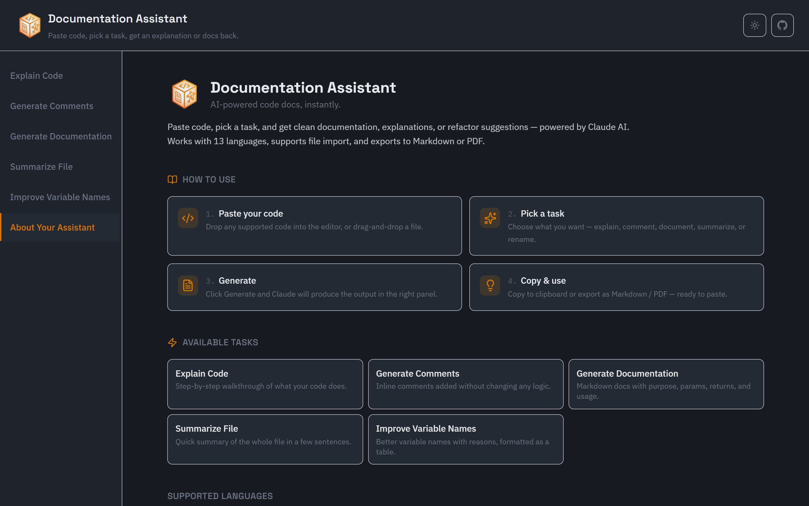

<style>
@import url('https://fonts.googleapis.com/css2?family=Inter:wght@400;500;600;700&family=JetBrains+Mono:wght@400;500&family=Space+Grotesk:wght@400;500;700&display=swap');
:root { --bg:#ffffff; --ink:#111827; --muted:#9ca3af; --accent:#111827; --line:#e5e7eb; --code:#f6f7f9; }
section {
  background:var(--bg); color:var(--ink);
  font-family:'Inter','Noto Sans','Pyidaungsu',sans-serif;
  font-size:26px; line-height:1.6; padding:64px 88px;
}
h1 { color:var(--ink); font-weight:700; font-size:1.7em; letter-spacing:-.01em; }
h1, h2, h3 { font-family:'Space Grotesk','Inter','Noto Sans','Pyidaungsu',sans-serif; }
h2 { color:var(--ink); font-weight:600; }
h3 { color:var(--muted); font-weight:600; text-transform:uppercase; letter-spacing:.06em; font-size:.8em; }
strong { color:var(--ink); font-weight:700; }
a { color:#2563eb; text-decoration:none; }
code { background:var(--code); color:#be123c; padding:.06em .35em; border-radius:4px; font-family:'JetBrains Mono',monospace; }
pre  { background:var(--code); border:1px solid var(--line); border-radius:8px; }
pre code { background:none; color:#111827; }
blockquote { border-left:3px solid var(--line); color:var(--muted); padding:.4em 1em; }
table th { background:var(--code); }
table td, table th { border-color:var(--line); }
header,footer,section::after { color:var(--muted); font-size:.5em; }
section.cover h1 { font-size:2.3em; }
section.cover h2 { color:var(--muted); font-weight:400; }
section.lead { background:#fafafa; }
</style>

<!-- _class: cover -->

# Documentation Assistant

## A developer tool for understanding and documenting code

Ye Min Aung · @mryeminaung · documentation-assistant

---

### About

# What is Documentation Assistant?

- An **AI-powered tool** that helps developers understand, document, and clean up code
- Paste code, pick a task, get clean documentation — **no accounts, no database, no setup friction**
- Built for developers who get handed unfamiliar code and need to understand it fast
- Wraps **five documentation tasks** into a focused, single-page UI

---

### Features

# What can it do?

| Task | What it does |
|------|--------------|
| **Explain Code** | Step-by-step walkthrough of what a snippet does |
| **Generate Comments** | Adds inline comments without changing any logic |
| **Generate Docs** | Produces Markdown docs — purpose, parameters, returns, usage |
| **Summarize File** | Short, high-level summary of an entire file |
| **Improve Names** | Table of naming suggestions with reasons, logic untouched |

Supports **13 languages** — JavaScript, TypeScript, Python, Java, C, C#, C++, Go, Ruby, PHP, SQL, Shell, Dart.

---

### More Features

# Built-in tools

- **File Upload & Drag-and-Drop** — import `.js`, `.py`, `.go`, and more
- **Syntax Highlighting** — CodeMirror editor with language support
- **Copy to Clipboard** — one-click copy of generated output
- **Export as Markdown or PDF** — save documentation for later
- **Light & Dark Mode** — theme toggle for your preference
- **Responsive Layout** — works on mobile, tablet, and desktop

---

### Architecture

# How it works

```bash
cd client && npm run dev   # React + Vite on :3000
cd server && npm run dev   # Express API on :8000
```

- **Frontend** — React 18, Vite, Tailwind CSS — task tabs, code editor, response panel
- **Backend** — Node.js, Express — prompt templates per task, calls the **Anthropic Claude API**
- **No database** — stateless by design, paste code and get a response

---

### Project Structure

# Folder layout

```
documentation-assistant/
├── client/              # React + Vite frontend
│   └── src/
│       ├── components/  # UI components (14 files)
│       ├── hooks/       # Custom React hooks
│       └── lib/         # Constants and utilities
├── server/              # Express backend
│   └── src/
│       ├── prompts/     # Task-specific prompt builders
│       ├── services/    # Claude API integration
│       └── middleware/  # Rate limiting, validation
├── screenshots/         # App screenshots
└── slides/              # Presentation decks
```

---

### Getting Started

# Setup in 3 steps

**1. Clone & install**

```bash
git clone https://github.com/mryeminaung/documentation-assistant.git
cd documentation-assistant
cd client && npm install
cd ../server && npm install
```

**2. Configure API key**

```bash
cd server
cp .env.example .env
# Add your ANTHROPIC_API_KEY to .env
```

**3. Run**

```bash
# Terminal 1 — backend
cd server && npm run dev

# Terminal 2 — frontend
cd client && npm run dev
```

Open `http://localhost:3000` in your browser.

---

### Screenshots

<p align="center">
<br/>
<strong>About</strong>
</p>

<p align="center">
<br/>
<strong>Explain Code</strong>
</p>

<p align="center">
<br/>
<strong>Generate Comments</strong>
</p>

---

### Screenshots (cont.)

<p align="center">
<br/>
<strong>Generate Documentation</strong>
</p>

<p align="center">
<br/>
<strong>Summarize File</strong>
</p>

<p align="center">
<br/>
<strong>Improve Variable Names</strong>
</p>

---

### Future Improvements

# What's next?

- **Streaming responses** — SSE instead of waiting for full completion
- **Multi-turn conversations** — follow-up questions about the same code
- **History** — save and view past analyses (would require a database)
- **Authentication** — per-user rate limiting and saved preferences
- **Unit tests** — for prompt builders and request validation

---

### Get started

# Links

- **Live:** https://documentation-assistant.vercel.app/
- **Repo:** github.com/mryeminaung/documentation-assistant
- **Stack:** React + Vite + Tailwind · Node + Express · Claude API
- **License:** MIT
